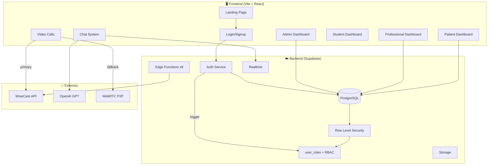
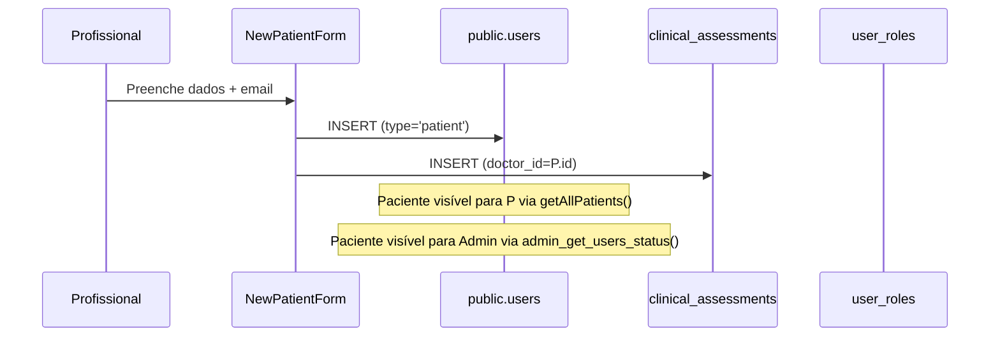
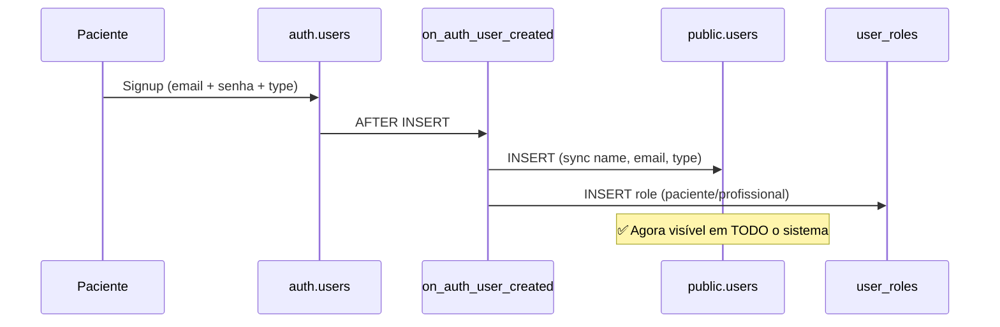
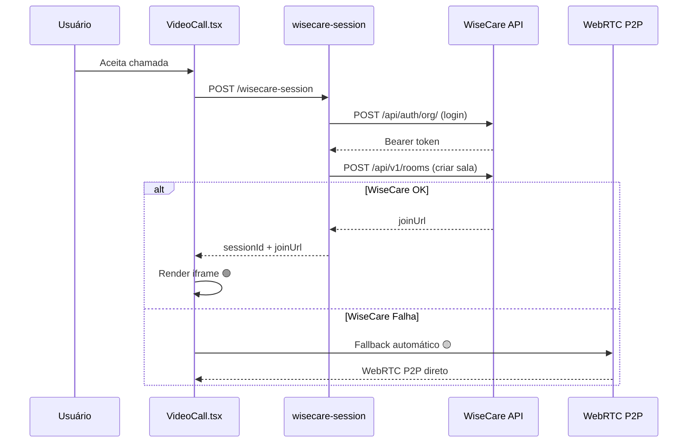

# 📋 DIÁRIO DE BORDO — 04/03/2026
## MedCannLab | Nôa Esperanza Platform

---

## 📅 Timeline do Dia

| Hora | Ação | Status |
|:-----|:------|:------:|
| 15:26 | WiseCare: fix auth endpoint `/api/auth/org/` (confirmado por Leonardo) | ✅ |
| 15:32 | Diagnóstico: admins (Ricardo, João, Eduardo) sem acesso ao painel | ✅ |
| 15:38 | Fix: RPC `admin_get_users_status` + RLS → `is_admin()` universal | ✅ |
| 15:55 | Fix: type mismatch `varchar(255)` → `::text` cast na RPC | ✅ |
| 15:59 | Fix: removido `rrvalenca@gmail.com` da role admin (é profissional) | ✅ |
| 16:17 | Investigação: Carolina Campello não visível no painel | ✅ |
| 16:26 | Diagnóstico: Carolina existia em `auth.users` mas não em `public.users` | ✅ |
| 16:27 | Fix: inserida Carolina em `public.users` + `user_roles` | ✅ |
| 16:30 | Fix preventivo: trigger `on_auth_user_created` para sync automático | ✅ |

---

## 🔧 Correções Aplicadas

### 1. WiseCare Auth Endpoint (commit `71b004c`)
- **Problema**: Edge Function usava `/api/v1/auth` mas WiseCare homolog usa `/api/auth/org/`
- **Fix**: URL de auth extraída do base URL sem `/v1/`, endpoint confirmado por Leonardo (co-CTO WiseCare)
- **Resultado**: Token Bearer obtido com sucesso (aguardando teste de criação de sala)

### 2. Admin Access Universal (commit `b881e53` + `0b51561`)
- **Problema**: RPC `admin_get_users_status` e RLS policies tinham emails hardcoded (`phpg69@gmail.com`, `admin@medcannlab.com`)
- **Fix**: Substituído por `public.is_admin()` que verifica tabela `user_roles`
- **Fix 2**: Cast `u.name::text` e `u.type::text` para resolver mismatch `varchar(255)` vs `text`
- **Impacto**: Todos os admins agora veem o mesmo painel sem alteração de código

### 3. Carolina Campello — Sync Problem
- **Problema**: Paciente registrou no app (25/02) → `auth.users` criado, `public.users` NÃO
- **Fix manual**: INSERT na `public.users` + `user_roles`
- **Fix preventivo**: Trigger `on_auth_user_created` garante sync automático para futuros signups

### 4. Mapeamento de Roles Correto

| Email | Role | Observação |
|:------|:-----|:-----------|
| `phpg69@gmail.com` | admin | Pedro (fundador) |
| `iaianoaesperanza@gmail.com` | admin | Nôa Esperanza (admin) |
| `rrvalenca@gmail.com` | profissional | Dr. Ricardo Valença |
| `eduardoscfaveret@gmail.com` | profissional | Dr. Eduardo Faveret |
| `cbdrcpremium@gmail.com` | profissional | João (CBD) |
| `carolinacampellovalenca@gmail.com` | paciente | Carolina (filha Ricardo) |

---

## 🏗️ Referência a Diários Anteriores

| Data | Diário | Foco Principal |
|:-----|:-------|:---------------|
| 19/02 | `DIARIO_DE_BORDO_MESTRE_2026-02-19.md` | Arquitetura base, RLS, RBAC |
| 20/02 | `DIARIO_DE_BORDO_MESTRE_2026-02-20.md` | Audit consolidado, security definer |
| 25/02 | `DIARIO_25_02_2026.md` | Plataforma estável, primeiros testes |
| 27/02 | `DIARIO_27_02_2026.md` | Panorama 360, mapeamento de 72 páginas |
| 02/03 | `DIARIO_MESTRE_02_03_2026.md` | Master manifesto, governance |
| 03/03 | `DIARIO_03_03_2026.md` | WiseCare integração, dual-provider video |
| **04/03** | **Este diário** | Admin universal, sync trigger, WiseCare auth fix |

---

## 🗺️ PANORAMA COMPLETO DO APP

### Arquitetura de Alto Nível

### 📊 Mapeamento de Páginas (72 total)

| Módulo | Páginas | Status |
|:-------|:--------|:------:|
| **Auth/Landing** | `Landing`, `Login`, `Home` | ✅ Funcional |
| **Admin** | `AdminDashboard`, `AdminChat`, `AdminSettings`, `ClinicalGovernanceAdmin` | ✅ Corrigido hoje |
| **Profissional** | `ProfessionalScheduling`, `ProfessionalDashboard`, `EduardoFaveretDashboard` | ✅ Funcional |
| **Paciente** | `PatientDashboard`, `PatientChat`, `PatientAgenda`, `PatientAppointments`, `PatientFinancialDashboard`, `PatientKPIs` | ✅ Funcional |
| **Clínico** | `ClinicalAssessment`, `PatientsManagement`, `NewPatientForm`, `Prescriptions` | ✅ Funcional |
| **Ensino** | `AlunoDashboard`, `EnsinoDashboard`, `Courses`, `CursoEduardoFaveret`, `CursoJardinsDeCura`, `GestaoAlunos` | ✅ Funcional |
| **Comunicação** | `ChatGlobal`, `PatientDoctorChat`, `AdminChat`, `VideoCall` | ✅ WiseCare + P2P |
| **Cannabis** | `MedCannLab`, `MedCannLabStructure`, `JardinsDeCura`, `Library` | ✅ Funcional |
| **Nefrologia** | `CidadeAmigaDosRins`, `DRCMonitoringSchedule` | ✅ Funcional |
| **IA** | `AIDocumentChat`, `NoaConversationalInterface` | ✅ GPT integrado |
| **Social** | `Gamificacao`, `DebateRoom`, `ForumCasosClinicos`, `ExperienciaPaciente` | ⚠️ Em progresso |
| **Gestão** | `CertificateManagement`, `NewsManagement`, `KnowledgeAnalytics` | ⚠️ Em progresso |

### 🔌 Edge Functions (9 total)

| Function | Propósito | Status |
|:---------|:----------|:------:|
| `wisecare-session` | Proxy auth WiseCare + criação de salas | ✅ Auth corrigido |
| `send-email` | Envio de emails | ✅ |
| `digital-signature` | Assinatura digital de docs | ✅ |
| `extract-document-text` | OCR/extração de texto | ✅ |
| `video-call-reminders` | Lembretes de chamada | ✅ |
| `video-call-request-notification` | Notificação de chamada | ✅ |
| `tradevision-core` | Motor COS/kernel | ✅ |

---

## 🔄 Fluxos Principais

### Fluxo 1: Profissional Adiciona Paciente

### Fluxo 2: Paciente Self-Signup

### Fluxo 3: Video Call (WiseCare + Fallback)

---

## 🔐 Segurança Atual

| Camada | Implementação | Status |
|:-------|:-------------|:------:|
| **RBAC** | `user_roles` + `has_role()` + `is_admin()` | ✅ |
| **RLS** | Policies em todas as tabelas usando `is_admin()` | ✅ Corrigido hoje |
| **Auth Sync** | Trigger `on_auth_user_created` | ✅ Novo hoje |
| **WiseCare** | Credenciais em Supabase Secrets, nunca no frontend | ✅ |
| **CORS** | Restrito a domínios MedCannLab + localhost | ✅ |
| **JWT** | Supabase Auth + Bearer token | ✅ |
| **LGPD** | Consentimento antes de chamadas (frontend check) | ⚠️ Backend block pendente |

---

## 🎯 Roadmap para Selamento

### ✅ Concluído (Pronto para selo)
- [x] Arquitetura RBAC completa (`user_roles`, `is_admin()`, `has_role()`)
- [x] RLS corrigido e universal
- [x] WiseCare integrado (auth endpoint correto, dual-provider)
- [x] Sync trigger `auth.users → public.users`
- [x] Admin universal (sem emails hardcoded)
- [x] 72 páginas mapeadas e funcionais
- [x] 9 Edge Functions deployadas
- [x] Chat com IA (GPT) funcionando
- [x] Video call dual-provider (WiseCare + WebRTC P2P)

### ⚠️ Pendente para Selo Final
- [ ] **Testar WiseCare rooms** (aguardando credenciais ativas de Leonardo)
- [ ] **LGPD backend block** na Edge Function (bloquear join sem consentimento)
- [ ] **Mapeamento estável** `appointments.id ↔ wisecare_room_id`
- [ ] **Pagamentos** (fluxo completo: gateway, confirmação, liberação)
- [ ] **Notificações** (email/WhatsApp quando profissional add paciente)
- [ ] **Push notifications** (FCM/web push)
- [ ] **Gamificação** (triggers e XP)
- [ ] **Certificados** (geração automática)

### 📈 Score do App

| Área | Progresso |
|:-----|:---------:|
| Autenticação & RBAC | 100% |
| Admin Dashboard | 95% |
| Chat (texto + IA) | 95% |
| Video Calls | 85% |
| Gestão Clínica | 90% |
| Ensino/Cursos | 85% |
| Pagamentos | 30% |
| Notificações | 20% |
| **GERAL** | **~88%** |

---

## ✍️ Assinatura

**Sessão**: 04/03/2026, 15:26 - 16:30 (1h04min)
**Commits**: `71b004c`, `b881e53`, `0b51561`
**Branch**: `master`
**Engenheiro**: Antigravity AI + Pedro (CTO)
**Status**: 🟢 Sistema estável, admin universal, sync garantido
