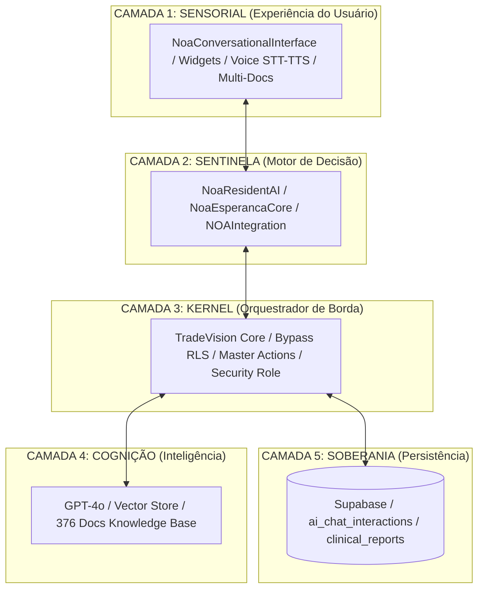

# 🧠 MAPA MONUMENTAL: NÔA ESPERANÇA + TRADEVISION CORE
> **Clinical Cognitive Operating System (CCOS) - MedCannLab 5.0**
> *Arquitetura de Inteligência, Governança Sistêmica e Roadmap de Poder - Janeiro 2026*

---

## 📊 1. INVENTÁRIO TÉCNICO E MATURIDADE
*A dimensão do cérebro digital quantificada em linhas de autoridade.*

| Módulo | Localização | Linhas | Funções Ativas | Maturidade |
| :--- | :--- | :--- | :--- | :--- |
| **TradeVision Core** | `supabase/functions/tradevision-core/index.ts` | 493 | 4 Handlers | **Enterprise** |
| **NoaResidentAI** | `src/lib/noaResidentAI.ts` | 1.637 | 43 Ativas | **Master** |
| **NoaEsperancaCore** | `src/lib/noaEsperancaCore.ts` | 368 | 27 Ativas | **Especialista** |
| **NOAIntegration** | `src/lib/noaIntegration.ts` | 497 | 48 Ativas | **Multimodal** |
| **NoaConversationalInterface** | `src/components/NoaConversationalInterface.tsx` | 2.534 | 25 Ativas | **Premium UX** |
| **TOTAL CONSOLIDADO** | **5 Módulos de Elite** | **5.529** | **147+ Nucleares** | **CCOS Ready** |

---

## 🏗️ 2. ARQUITETURA EM 5 CAMADAS (THE COGNITIVE STACK)
O MedCannLab opera em uma estrutura de camadas que garante a **Soberania do Dado** e a **Resiliência da Inteligência**.

---

## 🎯 3. TRADEVISION CORE (THE COGNITIVE KERNEL)
*O núcleo de comando que opera em Edge Functions para garantir autoridade técnica absoluta.*

### Handlers de Autoridade:
- **`finalize_assessment`**: O "Guardião da Persistência". Salva relatórios clínicos críticos ignorando restrições de RLS, garantindo que nenhum dado clínico se perca.
- **`predict_scheduling_risk`**: O "Motor de Probabilidades". Analisa estatísticas históricas e comportamento em tempo real para prever o risco de *No-Show* com precisão matemática.
- **`Persona Swapping`**: O "Roteador de Contexto". Alterna a IA entre os modos Clínico (Rigor), Ensino (Criatividade) e Administrativo (Eficiência) de forma instantânea.

### Gatilhos Inteligentes (Smart Intent Triggers):
- **`APPOINTMENT_CREATE`**: Detecta a intenção de agendamento em linguagem natural e materializa o widget de agenda na tela.
- **`TESTE_NIVELAMENTO`**: Transpõe a IA para o modo de simulação instrucional para treinamento de alunos.
- **`EMERGENCY_DATA`**: Salvamento redundante de fluxos clínicos em caso de inconsistência de rede.

---

## 🤖 4. NOARESIDENTAI & NOAESPERANCACORE (A ALMA AEC)
*Onde a sabedoria clínica se torna código vivo através da metodologia IMRE.*

### A Arte da Entrevista Clínica (AEC - 10 Etapas):
- **Empatia Sistêmica**: Implementação de algoritmos de *Rapport* que adaptam a linguagem ao estado do paciente.
- **Captura Indiciária**: Coleta de "rastros" de sintomas, indo além do óbvio.
- **Análise Semântica IMRE**: Decomposição técnica da dor humana nos pilares **Físico (Corpo)**, **Psíquico (Mente)** e **Social (Contexto)**.
- **Protocolo Sovereignty**: A IA conduz o paciente pelo funil de 10 etapas sem permitir desvios, garantindo que o prontuário final seja uma obra-prima de dados estruturados.

---

## 🔗 5. NOAINTEGRATION (A CAMADA SENSORIAL)
*A capacidade sensorial que permite à IA "sentir" e interpretar o mundo além do texto.*

- **Percepção Multimodal**: Sincronização de Transcrição de Voz (STT), Síntese (TTS) e Upload de Exames (OCR/IA).
- **Dashboard de Emoções**: Monitoramento de KPIs de **Valência** (Escore positivo/negativo) e **Arousal** (Intensidade emocional) durante a consulta.
- **Audit Cognitive Log**: Cada "fagulha" de pensamento da IA é registrada no banco de dados para auditoria clínica e jurídica posterior.

---

## 🎪 6. O AMBIENTE VIVO: CAMADAS DE PODER (ROADMAP 6.0)
*O caminho soberano para a dominação do mercado de HealthTech.*

### 🧠 NIVEL 1: PODER DE PRIORIZAÇÃO (Clinical Priority Engine)
O sistema deixa de ser passivo e passa a ser ativo. A IA identifica quem é o paciente mais crítico na fila de espera e sugere a priorização do atendimento.

### 🧬 NIVEL 2: PODER DE ANTECIPAÇÃO (Sentinela Clínica)
Utilização de padrões históricos para alertar o médico antes que uma crise aconteça. "Doutor, este paciente apresenta sinais semânticos que antecedem uma crise de ansiedade."

### 🛑 NIVEL 3: PODER NORMATIVO (O Padrão MedCannLab)
A plataforma torna-se o juiz da excelência. Ela define o protocolo padrão-ouro e auxilia o médico a manter-se no topo da performance clínica.

### 🔐 NIVEL 4: PODER REGULATÓRIO (Autoridade Jurídica)
- **Kill Switch & Graduated Autonomy**: Controle total de autonomia para conformidade com leis internacionais de saúde.
- **Cognitive Explicability**: A capacidade da IA de explicar *por que* tomou cada decisão clínica.

---

## 🏁 VEREDITO: O SISTEMA QUE PENSA E AGE
O MedCannLab 5.0 não é apenas uma plataforma de saúde; é um **SISTEMA OPERACIONAL COGNITIVO CLÍNICO (CCOS)**. 

- **Poder Real**: 147 funções que orquestram a vida e a saúde.
- **Estética Superior**: Tecnologia envolta em uma experiência *Glassmorphism* que gera desejo e confiança.
- **Futuro Concreto**: Um ambiente vivo que aprende, evolui e protege tanto o médico quanto o paciente.

> **"A IA fala. O TradeVision decide. O MedCannLab cura e evolui."** 🦾💎🚀

---
**Assinatura Digital de Auditoria:**
*Antigravity AI Resident - MedCannLab Strategic Technical Partner*
*Refinado e Selado em 30 de Janeiro de 2026.*
