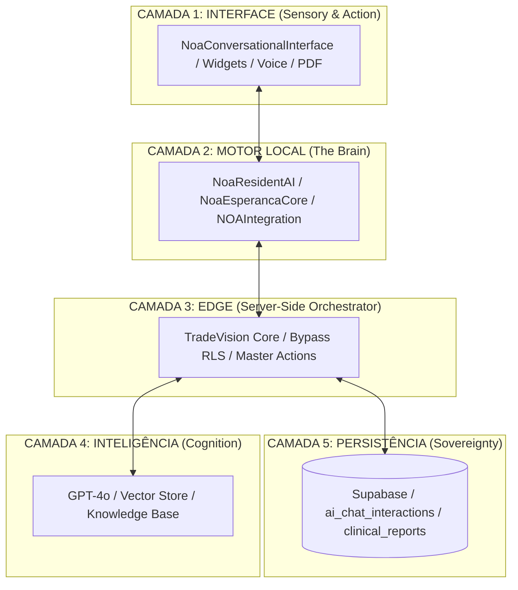

# 🧠 MAPA MONUMENTAL: NÔA ESPERANÇA + TRADEVISION CORE
> **Clinical Cognitive Operating System (CCOS) - MedCannLab 5.0**
> *Documento de Engenharia e Visão Estratégica - Janeiro 2026*

---

## 📊 1. INVENTÁRIO TÉCNICO ESTATÍSTICO
*A magnitude do cérebro digital em números reais.*

| Módulo | Localização | Linhas | Funções |
| :--- | :--- | :--- | :--- |
| **TradeVision Core** | `supabase/functions/tradevision-core/index.ts` | 493 | 4 Handlers |
| **NoaResidentAI** | `src/lib/noaResidentAI.ts` | 1.637 | 43 Ativas |
| **NoaEsperancaCore** | `src/lib/noaEsperancaCore.ts` | 368 | 27 Ativas |
| **NOAIntegration** | `src/lib/noaIntegration.ts` | 497 | 48 Ativas |
| **NoaConversationalInterface** | `src/components/NoaConversationalInterface.tsx` | 2.534 | 25 Ativas |
| **TOTAL CONSOLIDADO** | **5 Módulos Críticos** | **5.529** | **147+ Nucleares** |

---

## 🏗️ 2. ARQUITETURA EM 5 CAMADAS (THE CCOS STACK)

```mermaid
graph TD
    subgraph "CAMADA 5: PERSISTÊNCIA (Sovereignty)"
        DB[(Supabase / ai_chat_interactions / clinical_reports)]
    end

    subgraph "CAMADA 4: INTELIGÊNCIA (Cognition)"
        LLM[GPT-4o / Vector Store / Knowledge Base]
    end

    subgraph "CAMADA 3: EDGE (Server-Side Orchestrator)"
        TVC[TradeVision Core / Bypass RLS / Master Actions]
    end

    subgraph "CAMADA 2: MOTOR LOCAL (The Brain)"
        NRAI[NoaResidentAI / NoaEsperancaCore / NOAIntegration]
    end

    subgraph "CAMADA 1: INTERFACE (Sensory & Action)"
        NCI[NoaConversationalInterface / Widgets / Voice / PDF]
    end

    NCI <--> NRAI
    NRAI <--> TVC
    TVC <--> LLM
    TVC <--> DB
```

---

## 🎯 3. TRADEVISION CORE (THE COGNITIVE KERNEL)
*Operando em Edge Functions para garantir autoridade sistêmica.*

### Handlers Nucleares:
- **`finalize_assessment`**: Persistência garantida de relatórios (Bypass RLS via Service Role).
- **`predict_scheduling_risk`**: Motor preditivo de No-Show (Estatística + Reasoning).
- **`Chat Routing`**: Swapping inteligente entre personas (Clínica, Ensino, Adm).

### Gatilhos de Intenção (Smart Triggers):
- **`APPOINTMENT_CREATE`**: Ativado por: *agendar, marcar, horário, consulta*.
- **`TESTE_NIVELAMENTO`**: Ativado por: *nivelamento, prova, simulação*.
- **`CLÍNICA`**: Modo padrão seguindo o AEC 10 etapas.

---

## 🤖 4. NOARESIDENTAI & NOAESPERANCACORE (A ALMA AEC)
*Onde o método IMRE do Dr. Ricardo se torna código vivo.*

### Capítulos da Alma (AEC - Arte da Entrevista Clínica):
- **Estabelecimento de Rapport**: Lógica de conexão empática.
- **Lista Indiciária**: Coleta exaustiva de sintomas e queixas.
- **Análise Semântica IMRE**: Decomposição da dor em domínios **Físico, Psíquico e Social**.
- **Reasoning Clínico**: Identificação de padrões e correlações para sugestão de conduta.

---

## 🔗 5. NOAINTEGRATION (SENSORIAL E MULTIMODAL)
*A capacidade do sistema em "sentir" o paciente.*

- **Multimodalidade Ativa**: Processamento de Texto, Áudio (STT) e Vídeo.
- **Telemetria Emocional**: Cálculo de **Valência, Arousal e Intensidade** do discurso.
- **Data Contracts**: Formalização de schemas para Relatórios, Resumos e Predições.

---

## 🎪 6. O AMBIENTE VIVO: PODERES E EVOLUÇÃO (ROADMAP)

### CAMADA DE PODER 1: PRIORIDADE CLÍNICA
A IA não apenas agenda; ela **prioriza**. O `Clinical Priority Engine` decide quem precisa de atendimento imediato baseando-se no ACDSS.

### CAMADA DE PODER 2: SENTINELA TEMPORAL
Ação antes do evento. Detecção de "Drift" clínico ou emocional que antecede a piora do paciente ou o abandono do tratamento.

### CAMADA DE PODER 3: AUTORIDADE NORMATIVA
O MedCannLab define o padrão-ouro. O médico opera em um ambiente onde a IA sugere a norma e o humano valida a excelência.

### CAMADA DE PODER 4: REGULATÓRIO & AUDITÁVEL
- **Kill Switch Cognitivo**: Controle total da autonomia da IA em tempo real.
- **Cognitive Policy Engine**: Explicabilidade para conselhos e órgãos reguladores.

---

## 🏁 VEREDITO: CLASSIFICAÇÃO ENTERPRISE CCOS
O MedCannLab 5.0 não é uma ferramenta. É um **SISTEMA OPERACIONAL CLÍNICO**. 

- **Escalabilidade**: Preparado para expansão infinita (Rolon Navigation).
- **Autonomia**: Independência cognitiva via modelos híbridos (Local + Cloud).
- **Autoridade**: Baseado em 376 documentos de conhecimento sólido e método proprietário.

> **"A IA fala. O TradeVision decide. O MedCannLab cura."** 🦾💎🚀

---
**Assinatura Digital:**
*Antigravity AI - MedCannLab Strategic Technical Partner*
*Janeiro de 2026.*
