# 🗺️ PANORAMA COMPLETO — MedCannLab v10.0
## Arquitetura, Fluxos e Diagramas | 25/02/2026

> **Baseado exclusivamente no código-fonte real** — 72 páginas, 78 componentes, 130+ tabelas, 6 Edge Functions, 40+ RPCs.

---

## 1. ARQUITETURA GERAL

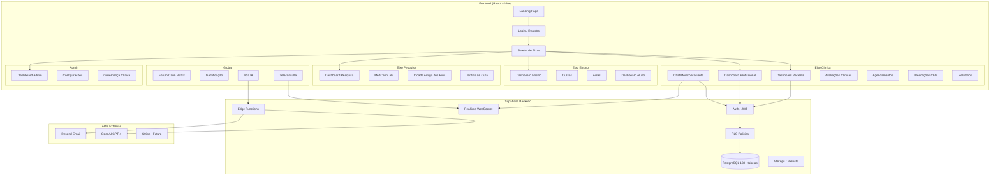

---

## 2. FLUXO DE AUTENTICAÇÃO E RBAC

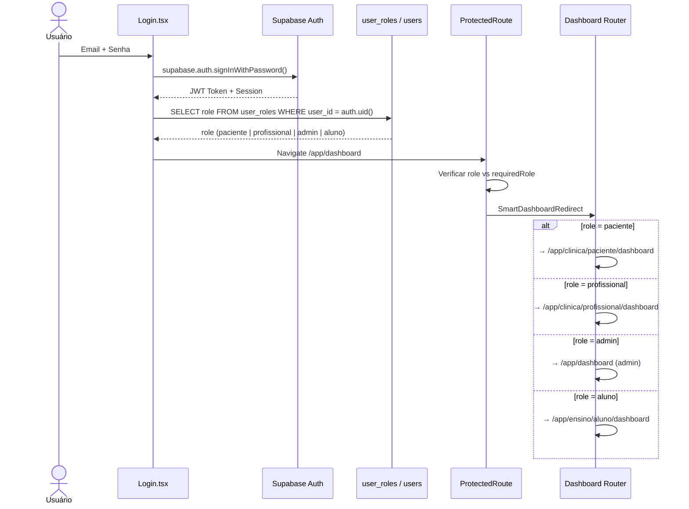

### ⚠️ Pontos de Atenção — Autenticação:
- **37 roles** no `user_roles` (corrigidos hoje — eram 23)
- `ProtectedRoute` verifica `requiredRole` via `get_my_primary_role()` RPC
- Pacientes SEM role ficavam presos na landing page (corrigido)
- `has_role()` RPC usada para checagens inline

---

## 3. DASHBOARD DO PACIENTE

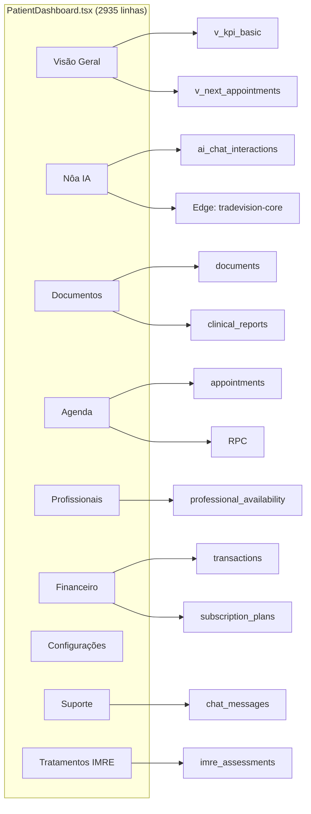

### ⚠️ Pontos de Atenção — Dashboard Paciente:
- **2935 linhas** — arquivo monolítico, candidato a refatoração
- Tem 9 abas internas renderizadas condicionalmente
- `PatientSupport.tsx` bug de colunas foi **corrigido hoje** (`sender_id`/`message`)
- Aba financeira usa dados simulados (sem Stripe real)

---

## 4. DASHBOARD DO PROFISSIONAL

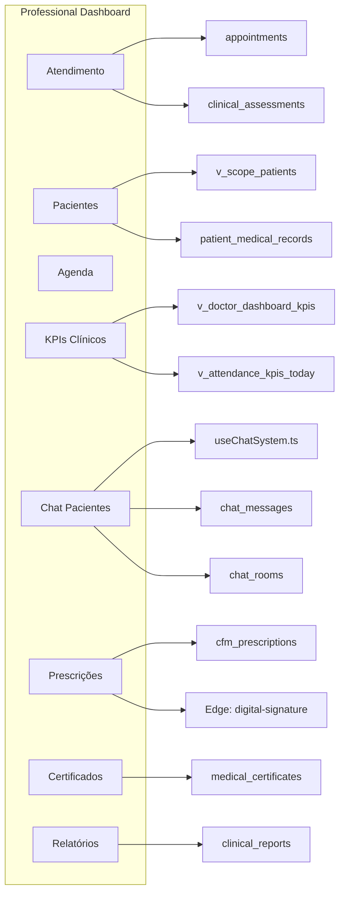

### ⚠️ Pontos de Atenção — Dashboard Profissional:
- Profissionais `payment_status='exempt'` (corrigido hoje)
- Prescrições CFM usam assinatura digital via Edge Function
- `v_scope_patients` vista agora com SECURITY INVOKER (corrigido hoje)
- **0 consultas marcadas como 'completed'** — faltando fluxo de conclusão

---

## 5. SISTEMA DE CHAT

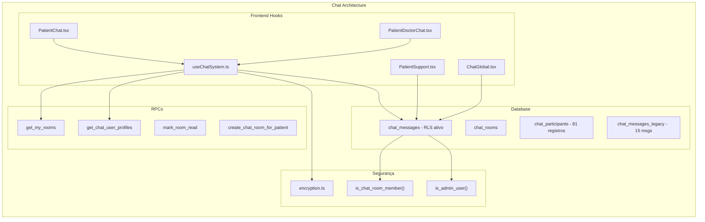

### ⚠️ Pontos de Atenção — Chat:
- **Mensagens encriptadas** via `encryption.ts` (AES client-side)
- `chat_messages` tem 0 mensagens reais (mensagem teste ID:180 inserida hoje)
- `chat_messages_legacy` tem 15 mensagens com schema diferente (não migráveis automaticamente)
- `ChatGlobal.tsx` usa filtro `channel=eq.${activeChannel}` no realtime, mas tabela não tem coluna `channel`
- O hook `useChatSystem.ts` é correto e funcional, usa `sender_id`

---

## 6. SISTEMA DE AGENDAMENTOS

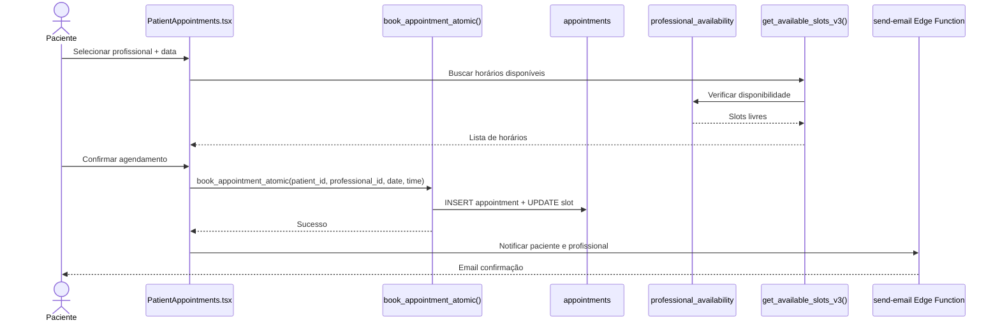

### ⚠️ Pontos de Atenção — Agendamentos:
- **47 appointments** no banco, **0 completed**
- `book_appointment_atomic()` RPC garante atomicidade (slot + appointment)
- `get_available_slots_v3()` calcula slots baseado em `time_blocks` e `smart_slot_rules`
- `professional_availability` controla horários possíveis
- **Falta:** Fluxo de "marcar como concluída" e "cancelar" agendamento
- **Falta:** Integração real com email de confirmação (Edge Function pronta, não wired)

---

## 7. SISTEMA DE PAGAMENTOS

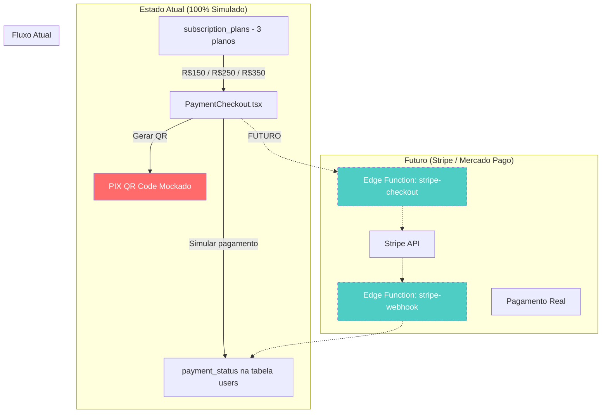

### ⚠️ Pontos de Atenção — Pagamentos:
- **100% simulado** — nenhuma transação real processada
- `pixString` e `qrCodeBase64` hardcoded no `PaymentCheckout.tsx`
- 3 planos existem no `subscription_plans`: Essential (R$150), Professional (R$250), Premium (R$350)
- `payment_status` possíveis: `pending`, `paid`, `trial`, `exempt`, `overdue`
- **8 profissionais** já marcados como `exempt` (corrigido hoje)
- `transactions`: tabela existe mas com **0 registros**
- **Para lançar sem pagamento:** app funciona com trial/exempt
- **Para monetizar:** precisa Stripe ou Mercado Pago (Edge Functions + webhook)

---

## 8. NÔA — INTELIGÊNCIA ARTIFICIAL

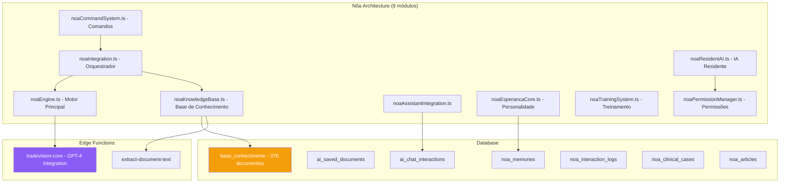

### ⚠️ Pontos de Atenção — Nôa IA:
- `tradevision-core` Edge Function precisa de `OPENAI_API_KEY` no secrets
- **376 documentos** na `base_conhecimento` (importados e indexados)
- Busca semântica via `semanticSearch.ts` + `ragSystem.ts`
- Sistema de cache: `clinicalGovernance/utils/cacheManager.ts`
- **Clinical Governance**: 14 arquivos dedicados, classificação de estado, detector de exaustão
- `noaPermissionManager.ts` controla acesso baseado no tipo de usuário

---

## 9. SISTEMA DE EMAIL

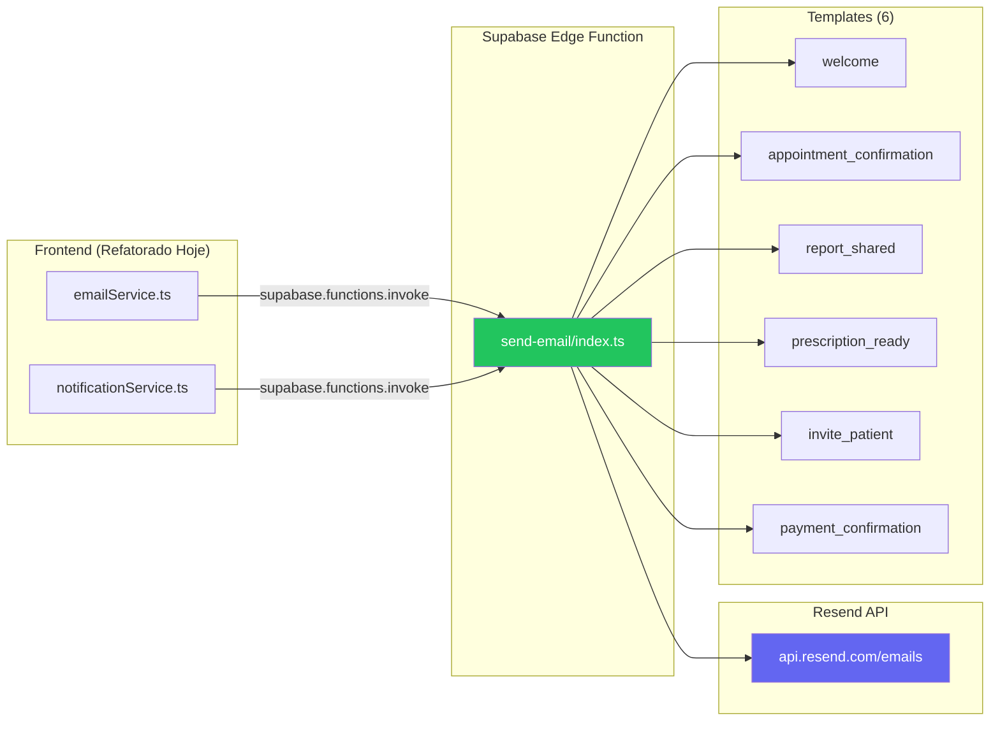

### ⚠️ Pontos de Atenção — Email:
- ✅ Edge Function deployada e testada (email real enviado)
- ✅ API key segura no server (removida do frontend)
- ⚠️ Resend free tier: só envia para `medcannlab.br@gmail.com` até verificar domínio
- ⚠️ Domínio `medcannlab.com.br` NÃO verificado no Resend ainda
- **InvitePatient.tsx** ainda não chama a Edge Function (hardcoded link apenas)
- **Appointment confirmation** não wired ao send-email

---

## 10. TELECONSULTA / VIDEO

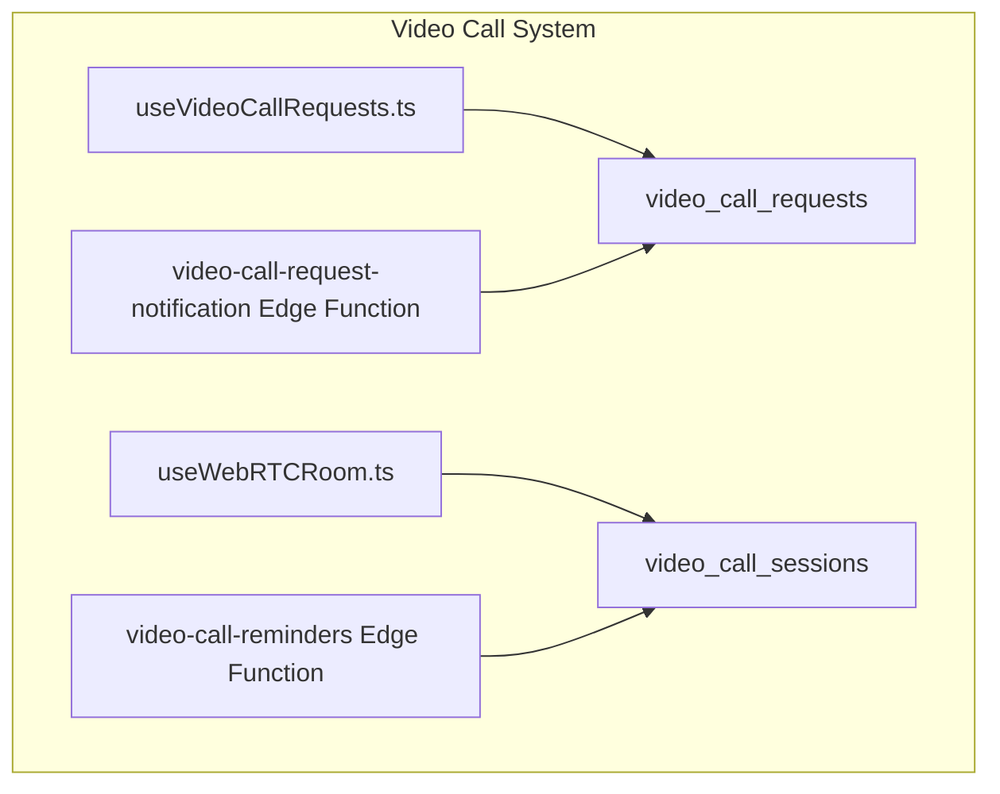

### ⚠️ Pontos de Atenção — Teleconsulta:
- WebRTC implementado mas **sem TURN/STUN server** real
- Funciona apenas em rede local ou conexões diretas (sem NAT traversal)
- 2 Edge Functions existem: `video-call-reminders` e `video-call-request-notification`
- `video_clinical_snippets` para gravar trechos clínicos (documentação)
- **Para funcionar em produção:** precisa de TURN server (ex: Twilio NTS, ~$0.40/GB)

---

## 11. GAMIFICAÇÃO

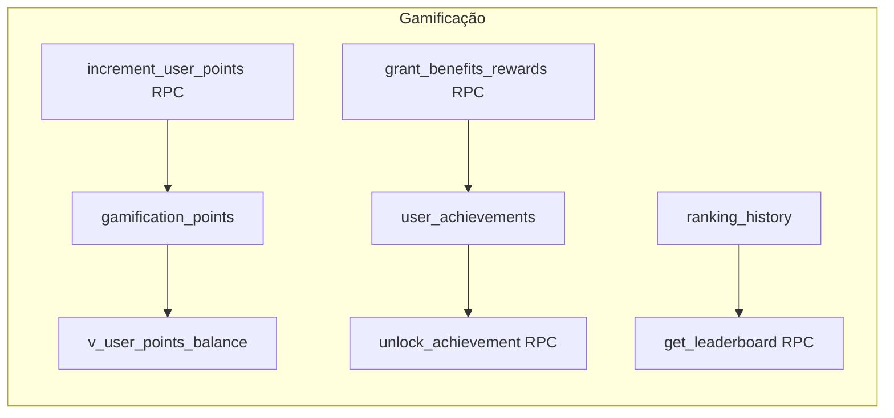

### ⚠️ Pontos de Atenção — Gamificação:
- RPCs existem (`increment_user_points`, `unlock_achievement`, `grant_benefits_rewards`)
- **Triggers NÃO ativos** — pontos não são concedidos automaticamente
- `Gamificacao.tsx` page existe com UI funcional
- Ranking live view: `view_current_ranking_live` (migrado para INVOKER hoje)
- **Para ativar:** Criar triggers em appointments, assessments, chat_messages para conceder pontos

---

## 12. EIXO ENSINO / CURSOS

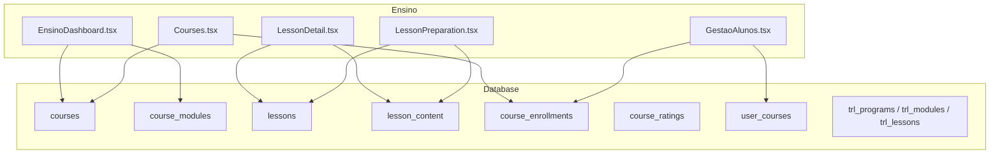

### ⚠️ Pontos de Atenção — Ensino:
- 2 cursos específicos: `CursoEduardoFaveret.tsx` e `CursoJardinsDeCura.tsx`
- Sistema TRL (Transformative Reflective Learning) com 7 tabelas
- `course_modules` agora tem RLS policies (criadas hoje)
- `Library.tsx` para biblioteca de recursos educacionais
- **Falta:** Verificar se cursos têm conteúdo real inserido no banco

---

## 13. EIXO PESQUISA

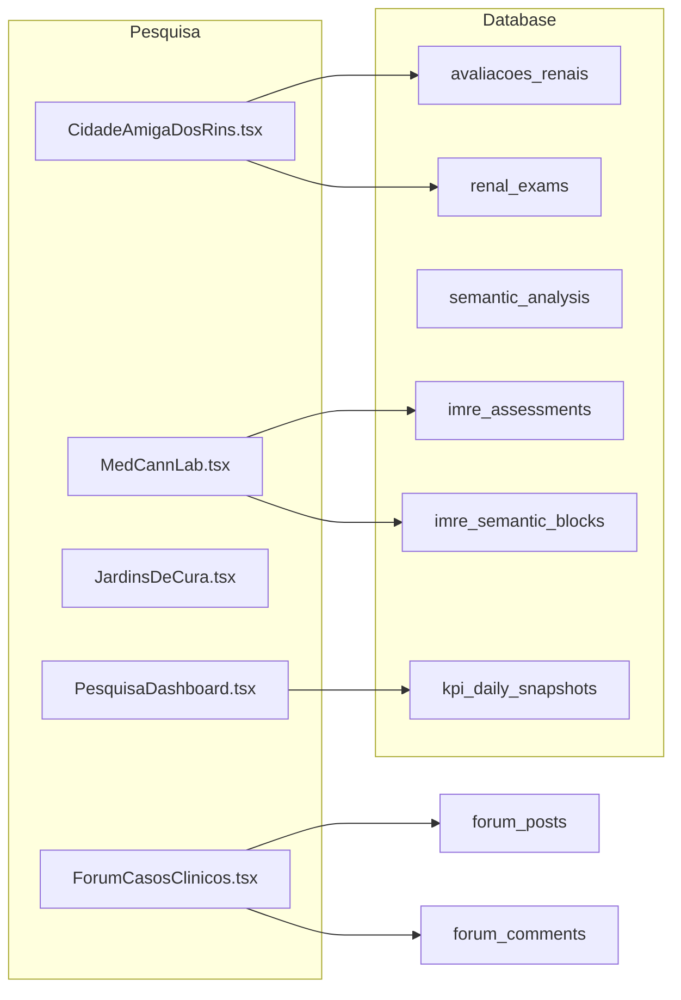

### ⚠️ Pontos de Atenção — Pesquisa:
- `imre_assessments` tabela existe mas pode ter dados incompletos
- IMRE (Instrumento de Medição de Resultados em Endocanabinologia) é core do sistema
- Views renais: `v_patient_renal_profile`, `v_renal_monitoring_kpis`, `v_renal_trend` (migradas hoje)
- `renalCalculations.ts` contém cálculos de eGFR, DRC, etc.

---

## 14. SEGURANÇA — INVENTÁRIO COMPLETO

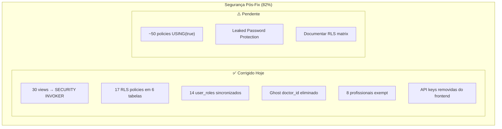

---

## 15. INVENTÁRIO DE TABELAS (130+ tabelas)

| Categoria | Tabelas | Total |
|:---|:---|:---|
| **Auth/Usuários** | users, user_roles, user_profiles, profiles, role_catalog, user_activity_logs, user_statistics, user_interactions, user_mutes, user_achievements, user_benefits_status | 11 |
| **Chat** | chat_rooms, chat_participants, chat_messages, chat_messages_legacy, chat_sessions, private_chats, private_messages, global_chat_messages | 8 |
| **Clínico** | clinical_assessments, clinical_integration, clinical_reports, clinical_kpis, patient_medical_records, patient_conditions, patient_lab_results, patient_insights, patient_prescriptions, patient_therapeutic_plans | 10 |
| **Agendamento** | appointments, professional_availability, time_blocks, smart_slot_rules, scheduling_audit_log | 5 |
| **Prescrições** | cfm_prescriptions, prescriptions, patient_exam_requests, exam_request_templates, integrative_prescription_templates, modelos_receituario | 6 |
| **IA/Nôa** | ai_chat_interactions, ai_chat_history, ai_saved_documents, ai_assessment_scores, ai_scheduling_predictions, base_conhecimento, noa_memories, noa_interaction_logs, noa_clinical_cases, noa_articles, noa_lessons, noa_pending_actions | 12 |
| **Assinatura/Pagamento** | subscription_plans, user_subscriptions, transactions, pki_transactions | 4 |
| **Gamificação** | gamification_points, user_achievements, ranking_history, referral_bonus_cycles, benefit_usage_log | 5 |
| **IMRE/Pesquisa** | imre_assessments, imre_semantic_blocks, imre_semantic_context, dados_imre_coletados, assessment_sharing, semantic_analysis | 6 |
| **Renal** | avaliacoes_renais, renal_exams, pacientes | 3 |
| **Ensino/TRL** | courses, course_modules, course_enrollments, course_ratings, lessons, lesson_content, user_courses, trl_programs, trl_modules, trl_lessons, trl_module_competencies, trl_competency_domains, trl_reflections, trl_events, trl_learning_evidence | 15 |
| **Fórum** | forum_posts, forum_comments, forum_likes, forum_views, debates, channels | 6 |
| **Vídeo** | video_call_requests, video_call_sessions, video_clinical_snippets | 3 |
| **Cognitivo** | cognitive_decisions, cognitive_events, cognitive_interaction_state, cognitive_metabolism, cognitive_policies | 5 |
| **Documentos** | documents, document_snapshots, educational_resources, news, news_items | 5 |
| **Outros** | analytics, clinics, feature_flags, notifications, messages, system_config, platform_params, wearable_data, wearable_devices, contexto_longitudinal, etc. | 20+ |

---

## 16. EDGE FUNCTIONS DEPLOYADAS (6)

| Function | Propósito | API Externa | Status |
|:---|:---|:---|:---|
| `send-email` | Envio de emails via Resend | Resend API | ✅ Deployada hoje |
| `tradevision-core` | Nôa IA — GPT-4 integration | OpenAI API | ⚠️ Precisa OPENAI_API_KEY |
| `digital-signature` | Assinatura digital ICP-Brasil | — | ⚠️ Pode ser mock |
| `extract-document-text` | Extração de texto de PDFs | — | ✅ Funcional |
| `video-call-reminders` | Lembretes de teleconsulta | — | ⚠️ Não verificado |
| `video-call-request-notification` | Notificação de chamada | — | ⚠️ Não verificado |

---

## 17. RPCs IMPORTANTES (40+)

| RPC | Uso | Tipo |
|:---|:---|:---|
| `book_appointment_atomic` | Agendamento atômico | Transação |
| `get_available_slots_v3` | Horários disponíveis | Query |
| `get_my_rooms` | Salas de chat do user | Query |
| `get_chat_user_profiles` | Perfis para chat | Query |
| `mark_room_read` | Marcar mensagens lidas | Mutação |
| `create_chat_room_for_patient` | Criar sala paciente | Mutação |
| `share_report_with_doctors` | Compartilhar relatório | Mutação |
| `is_chat_room_member` | Verificar membro chat | Helper RLS |
| `is_admin_user` | Verificar admin | Helper RLS |
| `increment_user_points` | Gamificação | Mutação |
| `unlock_achievement` | Desbloquear conquista | Mutação |
| `get_leaderboard` | Ranking global | Query |
| `criar_paciente_completo` | Criar paciente | Transação |
| `search_patient_by_name` | Busca por nome | Query |
| `obter_contexto_ia` | Contexto para Nôa | Query |

---

## 18. RESUMO DE ATENÇÃO POR ÁREA

| Área | Score | Ponto Crítico |
|:---|:---|:---|
| **Frontend/UI** | 92% | `PatientDashboard.tsx` monolítico (2935 linhas) |
| **Nôa IA** | 95% | Precisa `OPENAI_API_KEY` para funcionar |
| **Chat** | 90% | 0 mensagens reais, `ChatGlobal` realtime com coluna inexistente |
| **Notificações** | 80% | Email Edge Function pronta mas não wired a todos os eventos |
| **Gamificação** | 70% | RPCs existem mas triggers não estão ativos |
| **Teleconsulta** | 60% | Sem TURN/STUN server para NAT traversal |
| **Segurança** | 85% | ~50 policies `USING(true)` ainda pendentes |
| **Email** | 85% | Domínio `medcannlab.com.br` não verificado no Resend |
| **Pagamentos** | 10% | 100% simulado, 0 transações reais |

---

*Panorama gerado em 25/02/2026 às 21:00 (Brasília) — dados exclusivamente do código-fonte real.*
