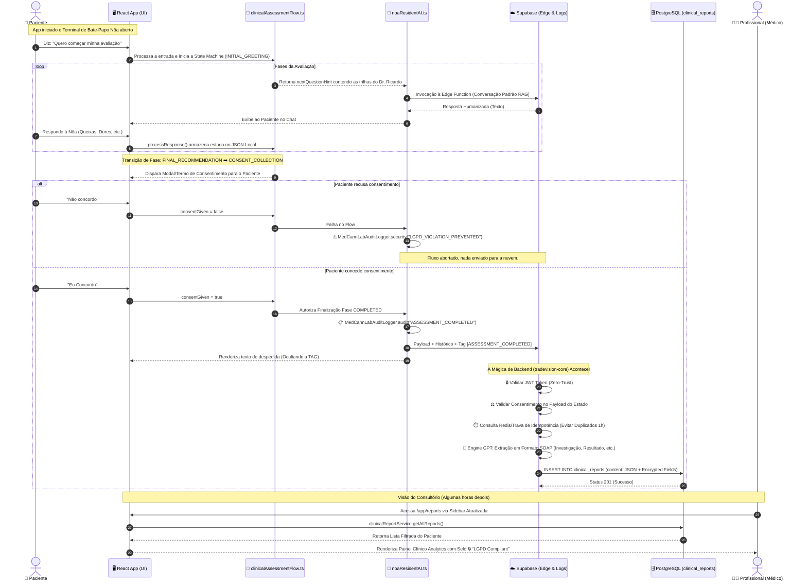

# 🗺️ Diagrama Master: Jornada da AEC (Avaliação Clínica Inicial)

Conforme sua solicitação, mapeei a estrutura de código real que reflete a experiência do usuário, desde a entrada no sistema até a entrega rastreável do laudo ao Médico, detalhando como as Edge Functions, UI Components e Travas LGPD se manifestam no fluxo.

## Como Ler os Principais Pontos no Código:
- **Passo 2 (Loop):** Gerenciado pela `clinicalAssessmentFlow.ts` lendo as strings de `complaintList` e `complaintDescription`.
- **Passos 3 e 4 (O Bloqueio Front-end):** Interceptado no `checkForAssessmentCompletion` dentro de `src/lib/noaResidentAI.ts`, onde amarramos hoje a validação `flowState?.data?.consentGiven`.
- **Passo 5 (Master Pipeline Supabase):** Ocorre unicamente na `supabase/functions/tradevision-core`, protegido pela dupla barreira (Idempotência/LGPD) que instalei ali.
- **Passo 7 (Visual Profissional):** Operado na `src/pages/Reports.tsx` em que o médico enxerga a avaliação sanitizada, os *Scores de Avaliação Orgânicos* (que não são mais "100/100" travados), e tem as opções de exportar e revisar os PDFs com as novas Badges de autoridade.
